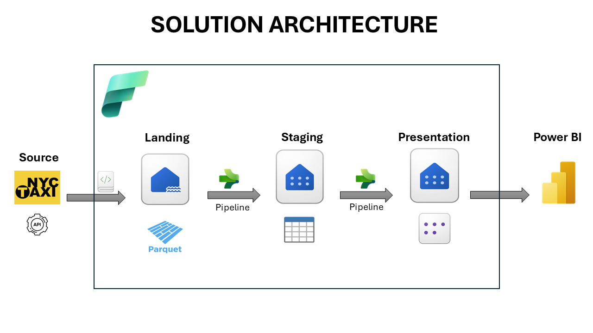

# 🚖 Ingeniería de Datos - Taxis NYC con Microsoft Fabric

Proyecto de ingeniería de datos enfocado en la automatización de ingesta, transformación y visualización de datos públicos de taxis en la ciudad de Nueva York, utilizando Microsoft Fabric.

---

## 🧠 Objetivo

El propósito de este proyecto es demostrar cómo implementar un flujo moderno de datos de extremo a extremo sobre Microsoft Fabric, aplicando buenas prácticas de **ingeniería de datos**. El flujo incluye automatización de ingesta desde una API, procesamiento con notebooks y visualización en Power BI.

---

## 🧱 Arquitectura de la Solución



1. **Landing / Bronze**  
   - Descarga automatizada de archivos `.parquet` desde una API pública (NYC Taxi & Limousine Commission).  
   - Los archivos se almacenan en la capa *bronze* del Lakehouse.

2. **Staging / Silver**  
   - Transformaciones iniciales: limpieza de columnas, tipos de datos, nulos.  
   - Enriquecimiento con *lookup tables* como zonas de taxi.

3. **Presentation / Gold**  
   - Agregaciones y estructura final para análisis.  
   - Preparación de datos para consumo por herramientas BI.

4. **Reporting**  
   - Conexión del modelo semántico desde Power BI a las tablas *gold*.  
   - Dashboards dinámicos con KPIs, gráficos y mapas interactivos.

---

## ⚙️ Automatización y Flujo de Trabajo

- La ingesta se realiza automáticamente con un notebook programado (PySpark).
- El notebook se conecta a la API, descarga el archivo correspondiente al mes actual y lo guarda en el Lakehouse.
- Luego, a través de un pipeline, se transforman los datos y los mueve de bronze a gold.
- Este flujo puede ejecutarse manualmente o como tarea recurrente.

---

## 🔨 Componentes Utilizados

Este proyecto combina múltiples herramientas del ecosistema de Microsoft Fabric y otras tecnologías clave para implementar una solución de datos moderna:

| Componente             | Descripción                                                                 |
|------------------------|-----------------------------------------------------------------------------|
| **Microsoft Fabric**   | Plataforma unificada para analítica de datos a gran escala.                |
| **Lakehouse**          | Modelo de almacenamiento unificado para datos estructurados en capas.      |
| **Warehouse**          | Motor SQL optimizado para análisis tabular y consumo BI.                   |
| **Data Factory**       | Orquestador de pipelines de datos dentro de Fabric para ETL y automatización. |
| **Pipelines**          | Flujo de trabajo que conecta notebooks, actividades de copia y transformaciones. |
| **Notebooks (PySpark)**| Scripts interactivos para ingesta, transformación y análisis.              |
| **Stored Procedures**  | Lógica SQL almacenada en el Warehouse para procesamiento adicional.        |
| **Power BI**           | Herramienta de visualización conectada directamente a las tablas *gold*.   |
| **API NYC TLC**        | Fuente de datos públicos en formato `.parquet` con registros de taxis.     |

---

## 📂 Estructura del Repositorio

```plaintext
├── notebooks/                              # Notebooks de procesamiento de datos
│   ├── Historical-Incremental Data.ipynb   # Ingesta automática desde API de Nueva York
│
├── powerbi/                                # Dashboard de Power BI
│   └── NYC Yellow Taxi Report.pbix         # Reporte final en Power BI
│
├── pipelines/                              # Carpeta de datasets
│   └── archivos json de los pipelines      # Archivos Parquet utilizados
│
├── assets/                                 # Archivos de recursos visuales
│   └── Presentacion1.png           # Diagrama de arquitectura de la solución
│
├── README.md                               # Documentación del proyecto
└── LICENSE                                 # Licencia del proyecto
